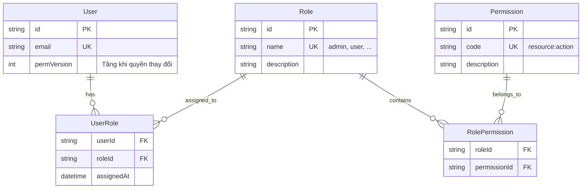

# RBAC — Role-Based Access Control

Hướng dẫn chi tiết về hệ thống phân quyền RBAC trong Backend Core Platform.

---

## 1. Data Model

Hệ thống sử dụng mô hình RBAC chuẩn với 5 entities trong database (Auth Service, schema `auth`):



### Quan hệ

- **User ↔ Role:** Many-to-Many (qua `UserRole`)
- **Role ↔ Permission:** Many-to-Many (qua `RolePermission`)
- Một User có thể có nhiều Roles, mỗi Role có nhiều Permissions
- Permissions được tính là **union** (hợp) của tất cả roles

---

## 2. Permission Codes

Permission code theo format `resource:action`. Danh sách hiện tại trong `packages/common/src/permission/permission.enum.ts`:

```typescript
export enum PermissionCode {
  // User management
  USER_READ = 'user:read',
  USER_CREATE = 'user:create',
  USER_UPDATE = 'user:update',
  USER_DELETE = 'user:delete',

  // Order management
  ORDER_READ = 'order:read',
  ORDER_CREATE = 'order:create',
  ORDER_REFUND = 'order:refund',

  // Product management
  PRODUCT_READ = 'product:read',
  PRODUCT_CREATE = 'product:create',
  PRODUCT_UPDATE = 'product:update',
  PRODUCT_DELETE = 'product:delete',

  // Notifications
  NOTIFICATIONS_READ = 'notifications:read',

  // Admin
  ADMIN_MANAGE_USERS = 'admin:manage-users',
  ADMIN_MANAGE_ROLES = 'admin:manage-roles',
}
```

### Seed Data

Permissions có sẵn sau khi chạy seed:

| Permission            | Mô tả                                 |
| --------------------- | ------------------------------------- |
| `notifications:read`  | Xem danh sách thông báo, unread count |
| `notifications:write` | Đánh dấu đọc / read-all thông báo     |

Roles có sẵn:

| Role    | Permissions                                 |
| ------- | ------------------------------------------- |
| `user`  | `notifications:read`                        |
| `admin` | `notifications:read`, `notifications:write` |

Users seed:

| Email               | Password    | Role  |
| ------------------- | ----------- | ----- |
| `admin@example.com` | `Admin@123` | admin |
| `user@example.com`  | `User@123`  | user  |

---

## 3. Cơ chế hoạt động

### 3.1. Permission Version (`permVersion`)

Mỗi User có trường `permVersion` (integer, default 1):

- Khi đăng nhập, `permVersion` được đưa vào JWT access token claims
- Khi admin thay đổi quyền (gán/bỏ role, sửa permission của role), `permVersion` **tăng lên 1**
- Token cũ (chứa `permVersion` cũ) sẽ trigger fetch lại permission từ DB
- Không cần logout/login lại — hệ thống tự detect sự thay đổi

### 3.2. Permission Guard Flow

```
Request với JWT (chứa userId, permVersion)
    │
    ▼
PermissionGuard
    │
    ├─ @Public() route? → ALLOW (skip)
    │
    ├─ No @RequirePermission()? → ALLOW (skip)
    │
    ├─ Internal JWT (type === 'internal')? → ALLOW (trusted service)
    │
    ├─ Check Redis cache: permissions:user:{userId}:
    │   ├─ Cache hit + permVersion match → use cached permissions
    │   └─ Cache miss or permVersion mismatch → fetch from Auth Service
    │       → GET /roles/users/{userId}/permissions (via PermissionProvider)
    │       → Update Redis cache
    │
    └─ User has required permission(s)?
        ├─ Yes → ALLOW
        └─ No → 403 Forbidden
```

### 3.3. Permission Cache (Redis)

- **Key:** `permissions:user:{userId}:`
- **Format:** Redis Hash
  - `permVersion` — version number (string)
  - `permissions` — JSON array of permission codes
- **Invalidation:** Khi role/permission thay đổi → `PermissionCache.invalidate(userId)`
- **Consistency:** Guard so sánh `cached.permVersion` vs `jwt.permVersion`

### 3.4. Token Type Guard

Ngoài RBAC, hệ thống có `TokenTypeGuard` để phân biệt loại token:

| Decorator         | Cho phép     | Chặn         |
| ----------------- | ------------ | ------------ |
| `@UserOnly()`     | User JWT     | Internal JWT |
| `@InternalOnly()` | Internal JWT | User JWT     |
| _(không dùng)_    | Cả hai loại  | —            |

`TokenTypeGuard` chạy sau `JwtAuthGuard`, trước `PermissionGuard`.

---

## 4. Sử dụng trong Code

### Bảo vệ endpoint với `@RequirePermission()`

```typescript
import { Controller, Get, Post, Body } from '@nestjs/common';
import { RequirePermission } from '@common/core';

@Controller('client/notification')
export class NotificationController {
  // GET — yêu cầu notifications:read
  @Get()
  @RequirePermission('notifications:read')
  findAll() {
    return this.notificationService.findAll();
  }

  // POST — yêu cầu notifications:write
  @Post()
  @RequirePermission('notifications:write')
  create(@Body() dto: CreateNotificationDto) {
    return this.notificationService.create(dto);
  }
}
```

### Đánh dấu endpoint public

```typescript
import { Public } from '@common/core';

@Get('healthz')
@Public()
healthCheck() {
  return { status: 'ok' };
}
```

### Giới hạn loại token

```typescript
import { InternalOnly, UserOnly } from '@common/core';

// Chỉ cho phép Internal JWT (service-to-service)
@Post()
@InternalOnly()
@RequirePermission('admin:manage-roles')
createRole(@Body() dto: CreateRoleDto) { ... }

// Chỉ cho phép User JWT
@Get('me')
@UserOnly()
getProfile() { ... }
```

---

## 5. Hướng dẫn thêm Permission mới

### Bước 1: Thêm vào PermissionCode enum

File: `packages/common/src/permission/permission.enum.ts`

```typescript
export enum PermissionCode {
  // ... existing

  // Thêm mới
  REPORTS_READ = 'reports:read',
  REPORTS_CREATE = 'reports:create',
}
```

### Bước 2: Tạo permission trong Database

**Cách 1: Thêm vào seed file**

File: `apps/auth-service/prisma/seed/role.seed.ts`

```typescript
const permReportRead = await prisma.permission.upsert({
  where: { code: 'reports:read' },
  update: {},
  create: {
    code: 'reports:read',
    description: 'Xem báo cáo',
  },
});
```

**Cách 2: Qua API (runtime)**

```bash
# Sử dụng admin JWT
curl -X POST http://localhost:3000/client/roles \
  -H "Authorization: Bearer <admin-jwt>" \
  -H "Content-Type: application/json" \
  -d '{"name": "reporter", "description": "Can view reports"}'
```

### Bước 3: Gán permission cho role

**Cách 1: Trong seed**

```typescript
await prisma.rolePermission.upsert({
  where: {
    roleId_permissionId: { roleId: roleAdmin.id, permissionId: permReportRead.id },
  },
  update: {},
  create: { roleId: roleAdmin.id, permissionId: permReportRead.id },
});
```

**Cách 2: Qua API**

```bash
curl -X POST http://localhost:3000/client/roles/assign-role \
  -H "Authorization: Bearer <admin-jwt>" \
  -H "Content-Type: application/json" \
  -d '{"userId": "<user-id>", "roleId": "<role-id>"}'
```

### Bước 4: Sử dụng trong controller

```typescript
@Get('reports')
@RequirePermission('reports:read')
getReports() {
  return this.reportService.findAll();
}
```

### Bước 5: Build lại packages

```bash
npm run build:packages
```

---

## 6. API Endpoints cho RBAC

### Role Management (`/client/roles`)

| Method | Route                                     | Permission           | Mô tả                |
| ------ | ----------------------------------------- | -------------------- | -------------------- |
| POST   | `/client/roles`                           | `admin:manage-roles` | Tạo role mới         |
| GET    | `/client/roles`                           | —                    | Danh sách roles      |
| GET    | `/client/roles/:id`                       | —                    | Chi tiết role        |
| PATCH  | `/client/roles/:id`                       | —                    | Cập nhật role        |
| DELETE | `/client/roles/:id`                       | —                    | Xóa role             |
| GET    | `/client/roles/users/:userId/roles`       | —                    | Roles của user       |
| GET    | `/client/roles/users/:userId/permissions` | —                    | Permissions của user |
| POST   | `/client/roles/assign-role`               | —                    | Gán role cho user    |
| POST   | `/client/roles/unassign-role`             | —                    | Bỏ role khỏi user    |

> Lưu ý: Endpoint `POST /client/roles` (tạo role) yêu cầu `admin:manage-roles` permission và `@InternalOnly()` trên Auth Service.

---

## 7. Troubleshooting

### 403 Forbidden dù đã gán quyền

1. **Kiểm tra `permVersion`:** `permVersion` trong JWT phải khớp với DB
2. **Xóa Redis cache:** `redis-cli DEL "permissions:user:{userId}:"`
3. **Kiểm tra chính tả:** Permission code trong decorator phải khớp với DB (`notifications:read` vs `notification:read`)
4. **Kiểm tra loại token:** Endpoint có `@UserOnly()` → Internal JWT sẽ bị chặn
5. **Refresh token:** Yêu cầu user refresh hoặc login lại để lấy JWT mới với `permVersion` đúng

### Permission không cập nhật sau khi gán role

1. Kiểm tra logic gán role có **tăng `permVersion`** hay chưa
2. Kiểm tra logic có **invalidate Redis cache** hay chưa
3. User cần refresh token để nhận JWT mới chứa `permVersion` mới

### Internal JWT bị 403

- Internal JWT (type `internal`) auto-bypass `PermissionGuard` — nếu bị 403, kiểm tra `TokenTypeGuard` hoặc `@UserOnly()` decorator
