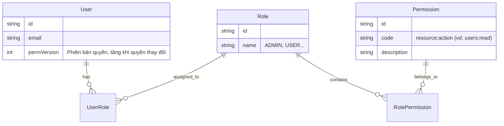

# RBAC Overview & How to Add New Permission

Tài liệu tổng hợp về hệ thống phân quyền RBAC (Role-Based Access Control) trong dự án, bao gồm mô hình dữ liệu, cơ chế hoạt động (`permVersion`, Cache, Guard) và hướng dẫn chi tiết các bước để thêm một quyền hạn mới.

---

## 1. Mô hình RBAC (Data Model)

Hệ thống sử dụng mô hình RBAC tiêu chuẩn với các thực thể chính trong Database (Prisma):

- **User**: Người dùng hệ thống.
- **Role**: Nhóm quyền hạn (ví dụ: `ADMIN`, `USER`, `MANAGER`).
- **Permission**: Quyền hạn cụ thể (ví dụ: `users:read`, `roles:create`).
- **UserRole**: Bảng trung gian gán Role cho User (N-N).
- **RolePermission**: Bảng trung gian gán Permission cho Role (N-N).

### Sơ đồ quan hệ



---

## 2. Cơ chế hoạt động (The Flow)

Hệ thống sử dụng chiến lược **Hybrid** kết hợp giữa JWT và Server-side Cache để đảm bảo hiệu năng cao nhưng vẫn thu hồi quyền tức thì (instant revocation).

### 2.1. `permVersion` (Permission Version)

- Mỗi `User` có một trường `permVersion` (integer, default 1).
- Khi đăng nhập, `permVersion` được gói vào **Access Token** (JWT).
- Khi Admin thay đổi quyền của User (gán Role mới, sửa Permission của Role), hệ thống sẽ **tăng `permVersion` của User lên 1**.
- **Tác dụng:**
  - Token cũ (chứa `permVersion` cũ) sẽ trở nên không hợp lệ hoặc kích hoạt việc fetch lại quyền từ DB.
  - Client không cần đăng nhập lại ngay, nhưng hệ thống nhận biết được sự thay đổi.

### 2.2. Gateway & Permission Guard

1.  **Request:** User gửi request kèm JWT (chứa `userId`, `permVersion`).
2.  **PermissionGuard (tại Gateway/Service):**
    - Kiểm tra cache (Redis) xem có danh sách quyền cho `key: permissions:user:{userId}` không.
    - **Cache Hit:** So sánh `cached.permVersion` với `jwt.permVersion`.
        - Nếu khớp: Dùng luôn danh sách quyền từ cache (nhanh).
        - Nếu lệch (`cached < jwt`): Cache lỗi thời -> Fetch lại từ DB.
    - **Cache Miss:** Gọi sang **Auth Service** (hoặc DB) để lấy danh sách permission mới nhất của User -> Lưu vào Redis -> Trả về.
3.  **Authorization:**
    - Kiểm tra xem danh sách quyền của User có chứa quyền yêu cầu bởi `@RequirePermission('code')` hay không.
    - Có -> Allow.
    - Không -> 403 Forbidden.

---

## 3. Hướng dẫn thêm Permission mới (How-to)

Giả sử bạn muốn thêm tính năng "Quản lý thông báo" và cần 2 quyền mới:
- `notifications:read`: Xem thông báo.
- `notifications:write`: Tạo/Sửa thông báo.

### Bước 1: Khai báo Permission trong Database (Seeding)

Mở file seed (ví dụ `apps/auth-service/prisma/seed/permission.seed.ts` hoặc tạo migration data):

```typescript
// Trong hàm seed permissions
const permissions = [
  // ... quyền cũ
  { code: 'notifications:read', description: 'Xem danh sách thông báo' },
  { code: 'notifications:write', description: 'Tạo hoặc sửa thông báo' },
];

// Chạy lệnh seed để insert vào DB
// npx prisma db seed
```

### Bước 2: Gán Permission vào Role

Bạn cần gán quyền này cho Role phù hợp (ví dụ `ADMIN` hoặc `MANAGER`). Có thể làm qua API hoặc Seed.

**Cách 1: Qua Seed (Code)**
```typescript
// Trong hàm seed roles
const adminRole = await prisma.role.findUnique({ where: { name: 'ADMIN' } });
const notifRead = await prisma.permission.findUnique({ where: { code: 'notifications:read' } });

await prisma.rolePermission.create({
  data: {
    roleId: adminRole.id,
    permissionId: notifRead.id,
  },
});
```

**Cách 2: Qua API (Runtime - Admin Dashboard)**
- Gọi API: `POST /client/roles/:roleId` (Update Role) và gửi danh sách `permissionIds` mới.
- Hệ thống sẽ tự động cập nhật và **tăng `permVersion`** của tất cả user thuộc Role đó (nếu logic update role được cài đặt chuẩn).

### Bước 3: Bảo vệ Endpoint tại Gateway / Controller

Tại Controller xử lý request (ví dụ `NotificationController` tại Gateway), sử dụng Decorator `@RequirePermission`:

```typescript
import { Controller, Get, Post } from '@nestjs/common';
import { RequirePermission } from '@common/core'; // Import từ shared package

@Controller('client/notification')
export class NotificationController {
  
  // Endpoint này yêu cầu quyền 'notifications:read'
  @Get()
  @RequirePermission('notifications:read')
  findAll() {
    return this.notificationService.findAll();
  }

  // Endpoint này yêu cầu quyền 'notifications:write'
  @Post()
  @RequirePermission('notifications:write')
  create(@Body() dto: CreateNotificationDto) {
    return this.notificationService.create(dto);
  }
}
```

### Bước 4: Kiểm thử (Verification)

1.  **Login** với User có Role `ADMIN` (đã gán quyền).
2.  Gọi API `GET /client/notification` -> **200 OK**.
3.  **Login** với User thường (chưa gán quyền).
4.  Gọi API `GET /client/notification` -> **403 Forbidden**.
5.  **Gán quyền nóng:** Dùng Admin gán quyền `notifications:read` cho User thường.
6.  User thường gọi lại API (với Token cũ) -> Hệ thống tự detect `permVersion` thay đổi (hoặc cache miss/invalidate) -> Fetch quyền mới -> **200 OK**.

---

## 4. Troubleshooting

- **Lỗi 403 dù đã gán quyền:**
  - Kiểm tra xem `permVersion` trong DB của user đã tăng chưa?
  - Kiểm tra Redis xem key `permissions:user:{id}` có tồn tại không? Xóa key đi để force reload (`redis-cli DEL permissions:user:{id}`).
  - Kiểm tra chính tả của `code` trong DB và trong Decorator `@RequirePermission`.
- **User không có quyền ngay sau khi gán:**
  - Đảm bảo logic "Gán Role" hoặc "Sửa Role" có gọi hàm `invalidatePermissionCache(userId)` hoặc tăng `permVersion`.

---